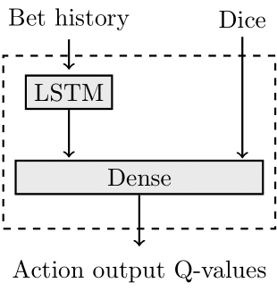

# Perudo-MARL
A project to create ML agents to play Perudo using Reinforcement learning (RL). The project is designed for 6 agents (Multi Agent RL (MARL)) to play each starting with 6 dice.
This uses a Q-learning algorithm with a Q-net to approximate Q-values. The agents can be trained with independent Q-learning, where each agent has its own Q-net and therefore policy set, or the agents can share a Q-net.

The Perudo environment is a modified version of [RuairiD’s Perudo repo](https://github.com/RuairiD/perudo).
The agent’s model makes a decision to bet or call dudo depending on the bet history of the round, (the arbitrary length history of the round is digested with an LSTM layer) and the player’s dice.

The Q-net architecture can be altered in the `q_net.py` file.
The Rewards for states can be altered in the `Perudo_environment.py` file.

The models can be trained by running the `Run_training.py` file.

`Python Run_training.py [number of q_nets (1 or 6)] [number of training episodes]`

